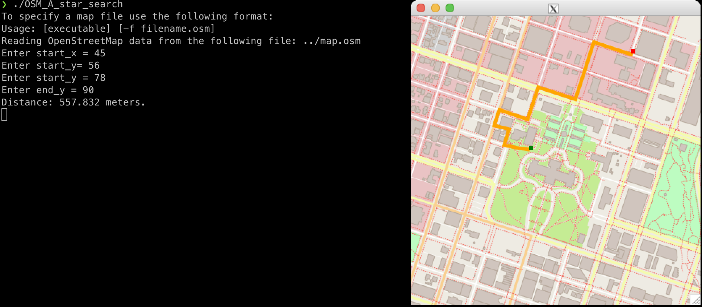
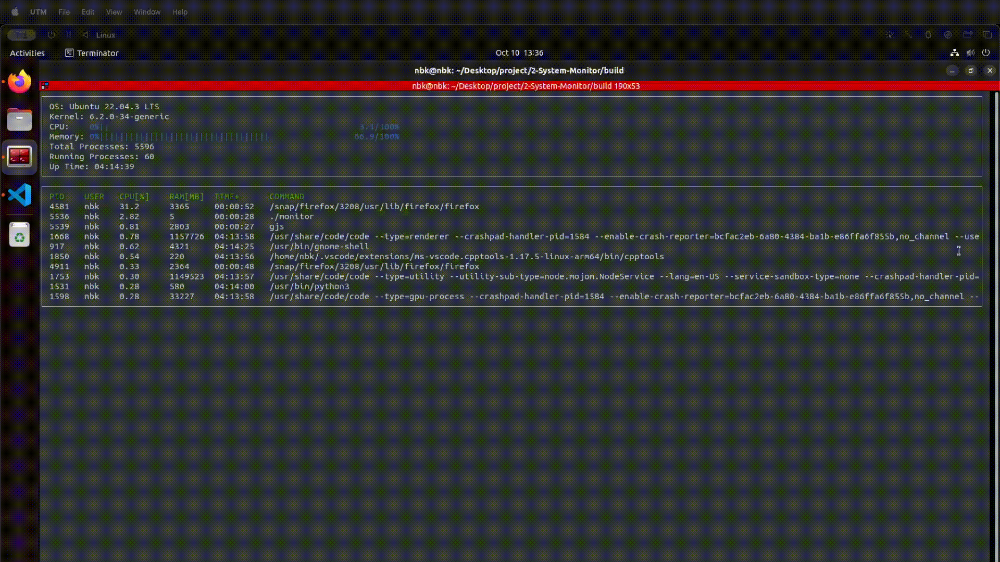

# C++ Developer Nanodegree Program

This repo is the collection of the projects in the [C++ Nanodegree Programm](hthttps://www.udacity.com/course/c-plus-plus-nanodegree--nd213).

The content of the nanodegree program consists of the following core courses:

- C++ Foundations
- Object-Oriented Programming
- Memory Management
- Concurrency
- A Capstone Project

## Course Project Demos

| OpenStreetMap Route Planner | System Monitor      | Memory Management Chatbot | Concurrent Traffic Simulation | Capstone Project |
| --------------- | ----------------------- | -------------- | -----|--- |
|   |  |   | work in progress | work in progress  |
| [code](https://github.com/nbkhuong/1-OpenStreetMap-Route-Planner/tree/865e67b707d2a0c537b56baaf54b163e8653efce)  | [code](https://github.com/nbkhuong/2-System-Monitor/tree/cbb310f0a61630e968795882aae8445b8670621f)                    | [code](https://github.com/nbkhuong/3-Memory-Mangement-Chatbot/tree/e6a9cc671a3ccaed98e6cceec9f00951fccd2106)         |[code](https://github.com/nbkhuong/4-Program-a-Concurrent-Traffic-Simulation/tree/14f24768b13512d34045dfced519f714c61344b7)|[code](https://github.com/nbkhuong/5-Capstone-Project/tree/7627402b12660480a9a52997d87cc48e3da441e9) |

## Installation Instructions

Clone the project and checkout master branch on each submodule.

```
$ git clone https://github.com/nbkhuong/CPP-Nanodegree --recursive
$ git submodule foreach "git checkout master"
```

For build/run instruction please refer to the README in each submodule.